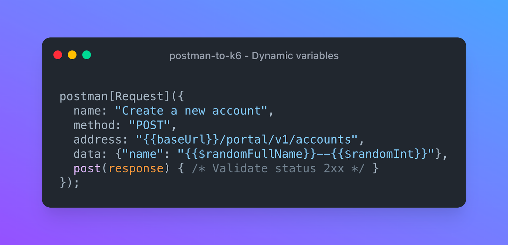
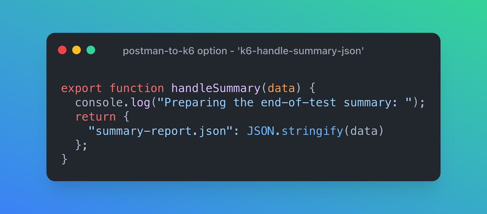
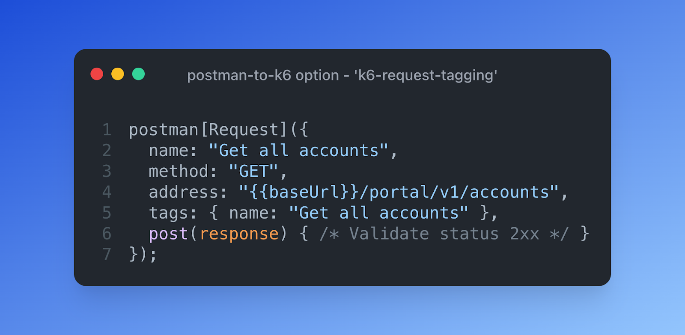
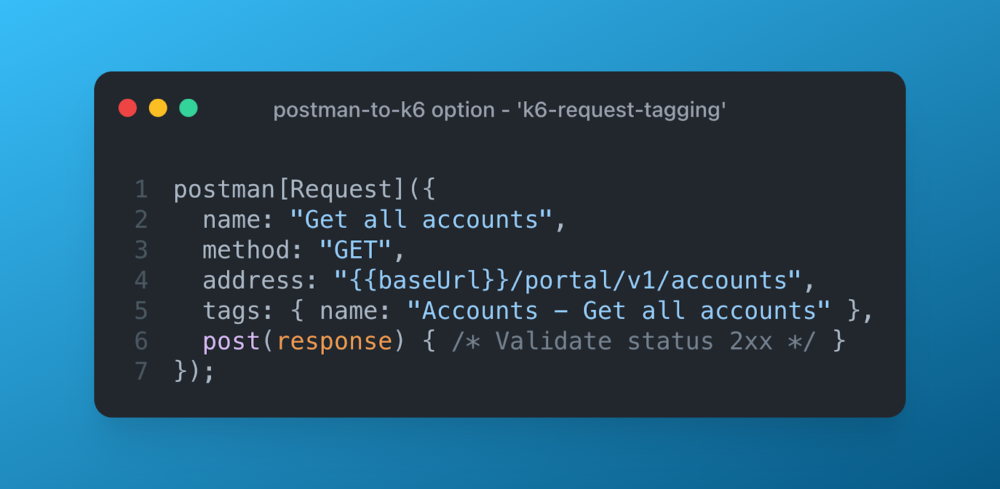
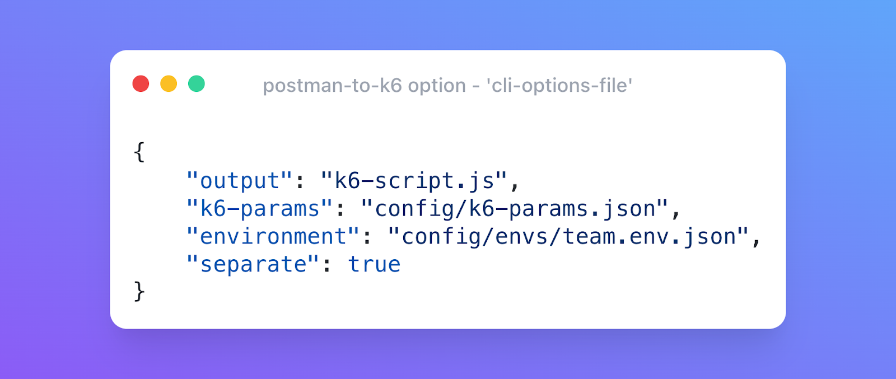

# Changelog highlights

As you might have noticed, the postman-to-k6 converter was rather inactive the last couple of months. With the help of the k6 team, the project will continue to be actively developed and maintained in a friendly fork => https://github.com/apideck-libraries/postman-to-k6. 

The postman-to-k6 converter has received some new features & bug fixes, since the 1.5.0 release. Let’s summarise some
highlights:

- [Full support of the Postman random functions/dynamic variables](#full-support-of-the-postman-random-functionsdynamic-variables)
- [K6 Handle Summary as JSON](#k6-handle-summary-as-json)
- [Generate K6 Request tags](#generate-k6-request-tags)
- [Manage postman-to-k6 CLI options in a file](#manage-postman-to-k6-cli-options)

## Full support of the Postman random functions/dynamic variables

By adding support for the
Postman [Dynamic Variables](https://learning.postman.com/docs/writing-scripts/script-references/variables-list/)
& [ReplaceIn](https://learning.postman.com/docs/writing-scripts/script-references/postman-sandbox-api-reference/#using-variables-in-scripts)
functions to the postman-to-k6 converter, it is now possible to apply any of the `{{$random}}` methods available in
Postman being used by K6 in the converted K6 scripts.



## K6 Handle Summary as JSON

K6 has built-in [summary](https://k6.io/docs/results-visualization/end-of-test-summary/#handlesummary-callback) options
to provide the results of a load test. To access the full summary, it is advised to use
the [handleSummary() callback](https://k6.io/docs/results-visualization/end-of-test-summary#handlesummary-callback),
since it allows completely customizing the end-of-test summary and exporting the summary report data in any desired
format (e.g. JSON, CSV, XML (JUnit/xUnit/etc.), HTML, TXT, etc.).

To facilitate the K6 summary capabilities, the postman-to-k6 converter allows the output of
the [K6 summary](https://k6.io/docs/results-visualization/end-of-test-summary/#handlesummary-callback) to be saved as a
file in JSON format.

```shell
$ postman-to-k6 collection.json --k6-handle-summary-json summary-report.json -o k6-script.js
```



By using the postman-to-k6 option `--k6-handle-summary-json`,the converter will add the K6handleSummary(data) function to
the generated K6 script, providing the functionality that K6 will store the summary output as JSON file locally. After
the K6 run, the K6 summary will be available in the “summary-report.json” file.

The “summary-report.json” file can be used as a data source for customer reporting
like the NPM packages <https://www.npmjs.com/package/k6-html-reporter>

Link: <https://github.com/apideck-libraries/postman-to-k6#k6-handle-summary-as-json>

## Generate K6 Request tags

K6 can add [ request name tags](https://k6.io/docs/using-k6/http-requests/#http-request-tags). These tags allow you to
filter your results during analysis. The generated postman-to-k6 requests support the tagging method, but that requires
manually adding the desired tags to all the generated requests.

To facilitate the reporting based on tags, we added the `--k6-request-tagging` option to
generate [K6 request name tags](https://k6.io/docs/using-k6/http-requests/#http-request-tags).

Through the option you can apply one of the available naming strategies:

- `none`: no automatic generated tags | default
- `request`: uses the request name as a tag (example "Get all accounts")
- `folder-request`: uses Postman folder name and the request name (example: "Accounts - Get all accounts")

Example `request` strategy

```shell
$ postman-to-k6 collection.json --k6-request-tagging=request -o k6-script.js
```



Example `folder-request` strategy

```shell
$ postman-to-k6 collection.json --k6-request-tagging=folder-request -o k6-script.js
```



Link: <https://github.com/apideck-libraries/postman-to-k6#k6-request-tag>

## Manage postman-to-k6 CLI options

Using all the postman-to-k6 options can result in quite a long and unclear list of parameters.

So we added a way to manage all the options in a separate configuration file and pass them along to the postman-to-k6
command. This will make CLI usage easier, especially in CI/CD implementations.

```shell
$ postman-to-k6 collection.json --cli-options-file cli-config.json
```



All the available CLI options can be used in the config file. By passing the CLI options as parameters, you can
overwrite the CLI options defined in the file.

Link: <https://github.com/apideck-libraries/postman-to-k6#cli-options-file>
